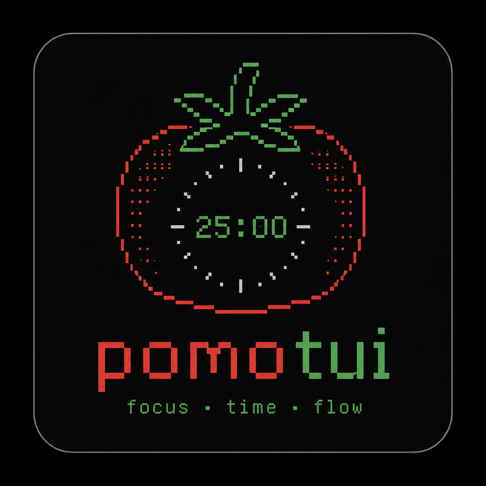
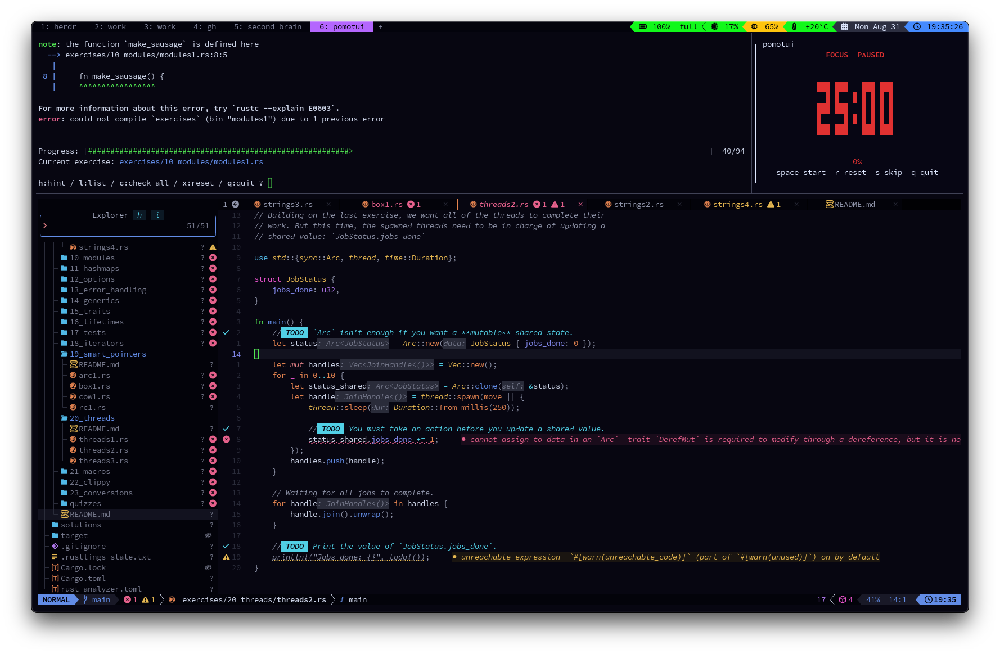
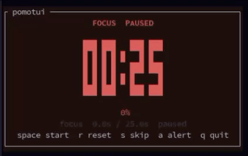

<p align="center">
  
</p>

# pomotui

A small pomodoro timer for the terminal. It counts down a focus phase, then a
break, and it repeats. At each phase change it plays a sound and blinks the
window.



## Demo

The clock rests at 00:00 for five seconds and blinks, then the next phase
starts. This recording runs in `--debug` mode, so the flags count seconds
instead of minutes.



## Install

You need Rust 1.88 or later. That is the floor `ratatui` 0.30 declares, and the
`Cargo.toml` records it. Built and tested on Rust 1.97.1.

```sh
git clone https://github.com/TheBabaYaga/pomotui.git
cd pomotui
cargo install --path .
```

To run it from the source tree instead:

```sh
cargo run --release
```

## Use

```sh
pomotui [--focus <MINUTES>] [--break <MINUTES>] [--debug]
```

| Flag | Short | Default | Range | Meaning |
| --- | --- | --- | --- | --- |
| `--focus` | `-f` | 25 | 1 to 1440 | Focus phase length, in minutes |
| `--break` | `-b` | 5 | 1 to 1440 | Break length, in minutes |
| `--debug` | | off | | Read both flags as seconds, and add the `a` key |

Examples:

```sh
pomotui                          # 25 minutes of focus, 5 minutes of break
pomotui -f 50 -b 10              # a longer cycle
pomotui --debug -f 3 -b 2        # a full cycle in five seconds
```

The app boots stopped with a full clock. Press `space` to start it. So the phase
is timed from your keypress, and not from the moment the app booted.

## Keys

| Key | Action |
| --- | --- |
| `space` | Start, pause, or resume |
| `r` | Reset this phase to its full length |
| `s` | Skip this phase |
| `a` | Debug mode only: fire the phase-end alert now |
| `q`, `Esc`, `Ctrl+C` | Quit |

## How it behaves

- **The clock reads the time. It never subtracts a tick.** Tick subtraction
  drifts, and it gives the wrong answer when the machine sleeps. Each phase
  stores its start time, so a stall or a sleep cannot make the clock wrong.
- **A phase that reaches 00:00 rests there for five seconds.** The clock holds,
  the window blinks every 500 ms, and a sound plays. Then the next phase starts.
- **Two sounds.** `Glass.aiff` means a break starts. `Ping.aiff` means a focus
  phase starts. So you know which phase began without looking at the screen.
- **The flash fills the background with the phase colour.** It takes the colour
  of the phase that ended, which is the phase the label still names.
- **A skip moves on at once.** It never holds and it never sounds, because you
  pressed the key and already know the phase changed.
- **It fits a small terminal.** The large clock falls back to a plain `MM:SS`
  when the block glyphs do not fit. A line that only half fits drops out. A 1x1
  terminal still draws without a panic.

## Sound support

The sound needs `afplay`, which ships with macOS. On any other system the spawn
fails, the app stays quiet, and the bell and the blink remain. The terminal bell
alone is not enough: many terminals, including iTerm2 by default, turn `\x07`
into a silent visual mark.

## Develop

```sh
cargo test              # 69 tests
cargo clippy --all-targets
cargo fmt --check
```

The logic is pure and testable. All input and output stays in `main.rs`.

```text
src/
├── main.rs    terminal setup, event loop, sound, flash timing
├── cli.rs     clap arguments, and the map to Config
├── timer.rs   the state machine, and the shared types
├── ui.rs      one pure draw function of a View snapshot
└── digits.rs  block glyphs for the large clock
```

Data flows one way. `main.rs` reads a key, calls the `Timer`, builds a `View`,
and calls `ui::draw`. The `Timer` never touches the terminal, and `ui::draw`
never touches the `Timer`. Every function that needs the time takes
`now: Instant`, so a test can drive a virtual clock.

## Scope

In scope: the focus and break cycle, start, pause, reset, skip, the duration
flags, and the debug mode.

Out of scope on purpose: a long break, a cycle counter, task labels, a task
list, saved statistics, and a config file.

## Licence

MIT. The full text is in [LICENSE](LICENSE), and every release archive carries
a copy.
